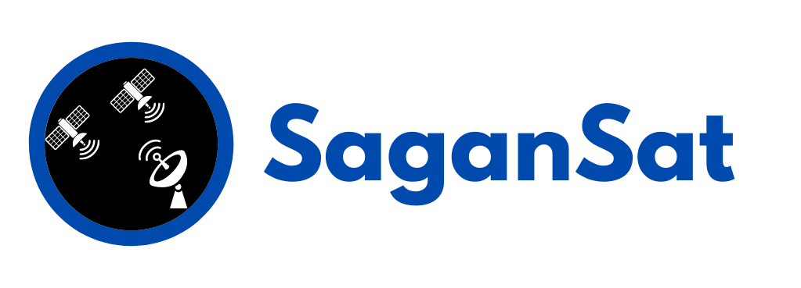

  

    <em>SaganSat, simulate the tasking of a satellites fleet.</em>

---
>> Somewhere, something incredible is waiting to be known. ― Carl Sagan.
---

## Description

El sistema de vuelo consiste de una estación terrena y de dos satelites de vuelo. Cada uno de estos elementos es un proceso independiente del sistema operativo.

La estacion terrena recibe una lista de tareas, y éste le indica a cada uno de los satelites que tareas tendra que realizar.

Las tareas tienen los siguientes atributos:
- nombre
- recursos: Lista de identificadores de recursos que necesita una tarea. Éstos funcionan
como locks excluyentes. Un satélite no puede ejecutar dos tareas que usen algún mismo
recurso. No hay un límite a la cantidad de recursos que una tarea puede usar o la cantidad
de recursos distintos que hay.
- payoff: El beneficio que genera ejecutar la tarea.

Ejemplo:
task1:
task2:
task3:
task4:
name="fotos", recursos=[1, 5], payoff=10
name="mantenimiento", recursos=[1, 2], payoff=1
name="pruebas", recursos=[5, 6], payoff=1
name="fsck", recursos=[1, 6], payoff=0.1
En éste caso una buena asignación sería la siguiente:
- La estación terrena le da task1 al satélite 1.
- La estación terrena le da task2 y task3 al satélite 2.
- La task4 no se puede realizar.

**La asignación de tareas debe maximizar el payoff.**

---

**Cuando el satélite recibe las tareas debe responder qué tareas pudo realizar y cuáles no en función
de una llamada a random diciendo que no pudo realizar una tarea el 10% de las veces.**

---

**TODO** mejorar la descripcion.

## Installation

### Manual

TODO

### Docker

TODO

## Run

TODO

## Use

TODO. 

Examples of using

## Test

TODO

## TODO

* Makefile
* Docker
* Logs messages
* Comunicacion entre procesos
* Instalable con setup
* Investigar la mejor forma de ordenar las Tasks, para maximizar el payoff.

## Licence

This project is licensed under the terms of the GNU GENERAL PUBLIC LICENSE, Version 3.
