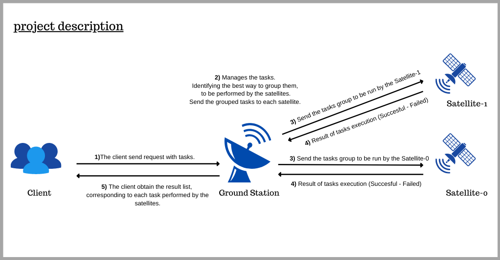
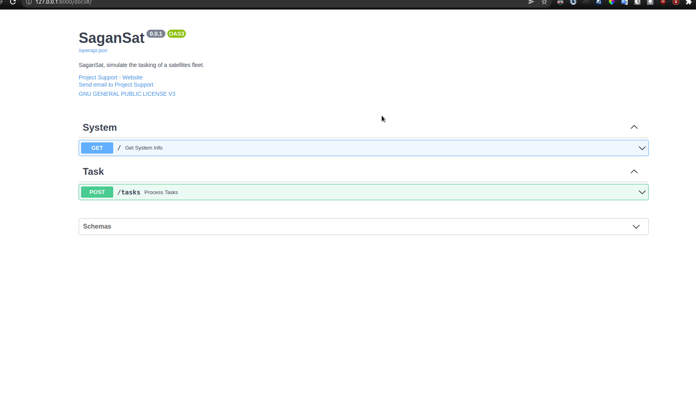

  

    <em>SaganSat, simulate the tasking of a satellites fleet.</em>

---
>> Somewhere, something incredible is waiting to be known. ― Carl Sagan.
---

## Description

SaganSat is a project that simulate the tasking of a satellite fleet.

The flight system consists of **one ground station** and **two flight satellites**. 
Each of these elements is a process independent of the operating system.

The ground station receives a list of **tasks**, 
and it tells each of the satellites what tasks it will have to perform.

### Task

The Tasks have the following attributes:
- **name**: Works as an identity of the task.
- **resources**: List of resource identifiers needed by a task. 
These function as **exclusive locks**. 
A satellite cannot execute two tasks that use the same resource. 
There is no limit to the number of resources a task can use or the number of different resources there are.
- **payoff**: The benefit generated by executing the task.

#### Example of Tasks

* task1
  * name="pictures"
  * resources=[1, 5]
  * payoff=10
* task2
  * name="maintenance"
  * resources=[1, 2]
  * payoff=1
* task3
  * name="proofs" 
  * resources=[5, 6]
  * payoff=1
* task4
  * name="fsck"
  * resources=[1, 6]
  * payoff=0.1

In this case, a good assignment by the Ground Station would be the following:

- The ground station gives **task1** to **satellite 1**.
- The ground station gives **task2** y **task3** to **satélite 2**.
- The **task4** cannot be performed.

### Constraints

* **Task assignment should maximize the payoff.**
* **A satellite cannot execute two tasks that use the same resource.**

### Satellites

When the satellite receives the tasks it simulates performing a task execution, 
responding with details about which tasks it was able to perform and which it couldn't 
be based on a call to random saying that it couldn't perform a task 10% of the time.

## Design

* The connection between the Client and the Ground Station is made with an **API REST**, 
implemented with the framework [FastAPI](https://fastapi.tiangolo.com/).
* The connection between the Ground Station and the Satellites, 
where each satellite is an independent process,
is made with [Pipes](https://docs.python.org/3/library/multiprocessing.html#pipes-and-queues), one per Satellite.
* The principle of [Memoization](https://en.wikipedia.org/wiki/Memoization#:~:text=In%20computing%2C%20memoization%20or%20memoisation,the%20same%20inputs%20occur%20again.) was used, so as not to make recalculations when seeing if there are tasks that have resources in common.

  The idea was: if a group of N Tasks have resources in common, 
  that means that at least one subgroup of 2 Tasks have resources en common.
  improving in 3X the time performance.

## Pre requisites

* Python>=3.6

This project was only tested with Python 3.6, but could theoretically run with Python >= 3.6.

## Installation

* Clone this repository.
* It's recommended create and activate a *virtual environment*, based in Python>=3.6.
* `make install`

## Run

* `make run`
* Access to [http://localhost:8000/](http://localhost:8000/) for see details of how to make requests to the API.

## Usage

You could make a POST requests to the endpoint [http://localhost:8000/tasks](http://localhost:8000/tasks), 
defining in the Body in JSON format, the list of Tasks that you want to perform.

This could be done by any REST client, for example [Postman](https://www.postman.com/), 
or could be done in the [/docs](http://localhost:8000/tasks) endpoint, which has a UI that allows it.

Example using the [/docs]() endpoint.

## Test

`make test`

In addition to executing the test suite, this command generates a coverage report too.

## To improve

* Through performance testing, using a list of tasks with required resources of the order of millions of elements, 
a considerable drop in performance is obtained, the system taking a long time to finish processing.

## Licence

This project is licensed under the terms of the GNU GENERAL PUBLIC LICENSE, Version 3.
